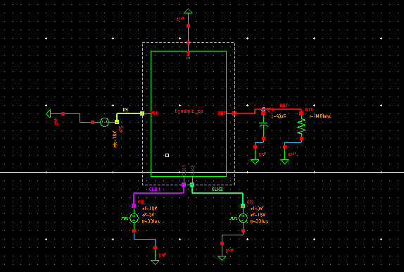

# Dynamic-gate-control-based-4-stage-charge-pump
The purpose of this Hackathon is to implement the proposed design in 28 nm PDK (Process Design Kit).
As a result of literature survey and Implemantation, this is a final Report Submission for successful completion of Dynamic-gate-control-based-4-stage-charge-pump and simulation, for [Cloud Based Analog IC Design Hackathon](https://www.iith.ac.in/events/2022/02/15/Cloud-Based-Analog-IC-Design-Hackathon/).

This repository presents the design of Dynamic-gate-control-based-4-stage-charge-pump implemented using Synopsis Custom Compiler on 28nm CMOS Technology.

# Table of Contents
 * [Introduction](#introduction)
 * [Working](#working)
 * [Tools Used](#Tools-Used)
 * [Schematics and Simulations](#schematics-and-Simulations)
 * [Netlist](#netlist)
 * [Observations](#observations)
 * [Author](#author)
 * [Acknowledgements](#acknowledgements)
 * [References](#references)

# Introduction:

Reducing power consumption in modern VLSI circuits and systems has become significant research due to more demand of low power memory devices. To reduce power consumption, the power supply voltage tends to be scaled down. It also reduces noise margin and speed of operation, which is not favour in digital circuits. The performance of the low power memory device depends on physical mechanisms of oxide tunneling which need constant high voltage irrespective of the MOS technology and scaling. Furthermore, low power devices such as EEPROM and flash memories require higher voltage to perform write and erase operations. Consequently,to design on-chip memory circuits with low power supply voltage is very difficult and critical challenge for nonvolatile memory applications. However, this problem is solved by charge pump (CP) circuits. The CP circuit provides higher on-chip voltage with low power supply voltage. The CP circuit utilize charge transfer switches (CTS) for transferring charges and pumping capacitors as energy storage elements. CP circuits are used in nearly all EEPROM and flash memory devices.The CP circuit is also used in the power managementblocks of liquid-crystal-display (LCD) panels and quiescent touch sensor power supply circuits.

# Working

   
  Reference Dynamic Gate Charge Pump Circuit

The voltage difference between 1st and last stage nodes at the end of each pumping cycle is given by V1 - Vn = N(VC - VT - VM) where VC is the voltage change at each node due to capacitive coupling by clock, VT is the threshold voltage drop of diode connected NMOS, VM is the voltage by which the capacitors are charged and discharged when the CP is supplying output current Iout and N is the number of Stages

            
             1) Vout = Vin + N[(C/C+Cp)*Vclk -Vt] - [Vt] - [N*Iout/(C+Cp)*f]
            
In dynamic gate control based CP the active control of substrate terminal voltage of the PMOS CTS is provided by two auxiliary PMOS transistors based on. While the dynamic gate control is provided by one PMOS and one NMOS. In dynamic gate control based CP the gate terminal voltage of CTS PMOS is controlled to reduce the ON resistance of the CTS PMOS. As the voltage step per stage in the CP is given by

Here C/Cp = a is a technology dependent parameter. As the gain and efficiency depends on the step size voltage at capacitor nodes. Therefore to increase the voltage gain and efficiency we need to increase the step size voltage change at the pumping capacitors. And this can be done only by reducing ROUT of PMOS pass transistors. ROUT is inversely proportional to the operating clock frequency and directly proportional to RON, the ON resistance of CTS PMOS. By using gate control scheme higher gate to source voltage is provided, by which the RON is reduced and voltage gain is increased.The four stage dynamic gate control based CP is shownin Fig. 5. Considering the second stage when Clk1 = 0 and Clk2 = VDD then PMOS in the gate control block P2 turns ON, shorting gate and source of the pass transistor P2. Which turns P2 OFF. Now when Clk1 = VDD and Clk2 = 0 then NMOS N2 in the gate control block turns ON and the gate terminal of PMOS P2 is connected to ground through N2. Which makes P2 to enter into linear region and charge transfer takes place from one pumping capacitor to another through P2 with low resistance. As charge is transferred from one stage to another the node voltages in the higher stages increase. And with increase in node voltages, gate to source voltages of PMOS CTS also increase which further reduces the ON resistance of PMOS CTS.

             2) Ron = 1/up*Cox*W/L(nVdd-Vt)

# Tools Used:

<b>• Synopsys Custom Compiler:</b> 
&emsp;The Synopsys Custom Compiler™ design environment is a modern solution for full-custom analog, custom digital, and mixed-signal IC design. As the heart of the Synopsys Custom Design Platform, Custom Compiler provides design entry, simulation management and analysis, and custom layout editing features. This tool was used to design the circuit on a transistor level.

<b>• Synopsys Primewave:</b> 
&emsp;PrimeWave™ Design Environment is a comprehensive and flexible environment for simulation setup and analysis of analog, RF, mixed-signal design, custom-digital and memory designs within the Synopsys Custom Design Platform. This tool helped in various types of simulations of the above designed circuit.

<b>• Synopsys 28nm PDK:</b> 
&emsp;The Synopsys 28nm Process Design Kit(PDK) was used in creation and simulation of the above designed circuit.

# Schematics and Simulations:

## Schematics:

### Charge Pump Circuit:
Initially Schematic of the Dynamic Gate Charge pump cell was implemented and converted into a symbol so that it could be used directly as cell from the library.

   
  Fig.1: Dynamic Gate Charge Pump Cell Schematic

   
  Fig.2: Dynamic Gate Charge Pump Symbol

   
  Fig.3: Dynamic Gate Charge Pump Circuit

## Simulations:
### Transient Analysis:
After creating and saving the schematic go to 'Tools' and open 'Primewave' to start the simulation. In the Primewave select the 'model file' i.e the '28nm PDK's .lib file presentin the HSPICE folder. After this select the 'tran' analysis in the analysis window and give the 'Start', 'Stop', and 'Step Size' parameters and save it. Then add the outputs which needs to be plotted by selecting the nets on the schematic and Add the function to Calculate the Risetime  
Then go to 'Simulations -> Netlist and Run' to generate a netlist and run the simulation to get the below output.

   
  Fig.4: Dynamic Gate Charge Pump Transient Analysis

<b>Rise Time = 10.96 us </b>

### Parametric Sweep:
This is basically used to plot any output attribute over varying input attribute. Specific to this design we are going to vary the control voltage and supply voltage to plot the varying frequency. For this, in the schematic we have to give a variable in the 'DC Voltage' parameter of the VDC components. Then add this variables in the Primewave under variables window and select 'sweep' in that window for each variable. In the parametric sweep window give the 'Start', 'Stop' and 'Step Size'. In the outputs add the function to calculate <b>Gain = 2.77</b> for 1.8V and run the simulation to get the below output and analog Scalar Value.

   
  Fig.5: DC sweep of O/P for different I/O 

# Netlist:

- Refer to the netlist of the circuit here: <a href='Netlist and Logs/Dynamic_CP.cir'>Dynamic Gate Charge Pump Circuit</a>
- Refer to the netlist of the circuit with parameteric sweep here: <a href='Netlist and Logs/Dynamic_CP_Parametric.cir'>Dynamic Gate Charge Pump Circuit With Varying Voltage</a>

# Observations:
- The output voltage is 5V .The voltage gain has significantly improved as threshold voltage drop is removed and ON resistance of Charge Transfer Switch is reduced. Further, the substrate bias effect in the Charge Pump circuitis also removed.However operated in Strong inversion region has caused this circuit to have a trade-of between gain and speed hence the circuit can be used for high speed application that is indicated with low rise time as stated above but it has low noise margin as well as low SNR this can be seen in the transient analysis.

# Author:
• Tarush Singh, B.E(ECE), MCT Rajiv Gandhi Institute of Technology, Andheri, Versova-400053.

# Acknowledgements:
• <a href='https://www.iith.ac.in/events/2022/02/15/Cloud-Based-Analog-IC-Design-Hackathon/'>Cloud Based Analog IC Design Hackathon</a> 
• <a href='https://www.synopsys.com/'>Synopsys India</a> 
• <a href='https://www.vlsisystemdesign.com/'>VLSI System Design (VSD) Corp. Pvt. Ltd India</a> 

# References:
- P. Karuppanan, K. Khan, and S. R. Ghosh, “Dynamic gate and substrate control charge pump circuits,” in Analog Integrated Circuits and Signal Processing, April 2015.
- H. Dadhich, V. Maurya, K. Verma, and S. Jaiswal, “Design and analysis of different type of charge pump using cmos technology,” in 2016 International Conference on Advances in Computing, Communications and Informatics (ICACCI), November 2016.
- M. E. Alaoui, F. Farah, K. E. Khadiri, H. Qjidaa, A. Aarab, and R. E. Alami, “Analysis and design of dickson charge pump for eeprom in 180nm cmos technology,” in 2018 International Conference on Intelligent Systems and Computer Vision (ISCV), My 2018
